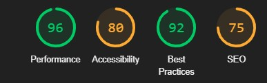

# Reddit 2.0

Reddit 2.0 - Reddit clone with cool **Avatars**, subreddits, and reddit oAuth authentication.

**Application Features**  
* Reddit Login
* Create/Search Posts
* Posts created in subreddits

Website Link: [Reddit 2.0](https://reddit-2-0-six.vercel.app)

## Tech Stack
* Nextjs
* React
* NextAuth
* Recoil
* Tailwind CSS
* React Hook Forms
* Express.js
* REST APIs
* MongoDB

This is a [Next.js](https://nextjs.org/) project bootstrapped with [`create-next-app`](https://github.com/vercel/next.js/tree/canary/packages/create-next-app).

## Getting Started

First, run the development server:

```bash
npm run dev
# or
yarn dev
```

Open [http://localhost:3000](http://localhost:3000) with your browser to see the result.

Create `.env` file at the root of project, and add the folling code.

```
MONGODB_URI = <Your Database URL>
REDDIT_CLIENT_ID = <Your Reddit Client Id>
REDDIT_CLIENT_SECRET = <Your Reddit Client Seceret>
NEXTAUTH_SECRET = <Any Random String>
NEXTAUTH_URL= <Your Site URL>
```

## Reddit Client Id & Secret
To generate `reddit client id` and `secret` go to https://www.reddit.com/prefs/apps , and create an app there.
You will get client id and secret for the app. And, in the redirect uri add `NEXTAUTH_URL/api/auth/callback/reddit`

## Screenshots

##### Landing Page

 
 

#### Subreddit
 

#### Post

 

#### Lighthouse Stats
